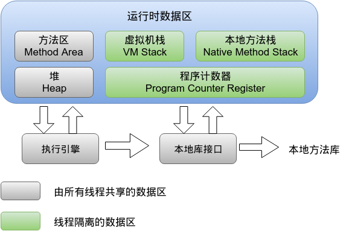

对于Java开发而言，找工作面试基本上都会问道 JVM 这个知识点，其中涉及结构组成、作用原理、异常排查和参数调优等等。

<!-- more -->

## JVM 是什么

Java 虚拟机，Java Virtual Machine 简称 JVM。JVM 主要包括类加载器（ClassLoader）子系统、运行时数据区和执行引擎三部分。  
Java语言使用Java虚拟机屏蔽了与具体平台相关的信息，使得Java语言编译程序只需生成在Java虚拟机上运行的目标代码（字节码），就可以在多种平台上不加修改地运行。

## JVM内存模型



## JVM 运行时数据区
1. 虚拟机栈  
   栈是线程私有，用来存放局部变量、对象引用和常量池引用。方法执行的时候会创建一个栈帧，存储了**局部变量表、操作数栈、动态链接和方法出口信息**。每个方法从调用到执行完毕，对应一个栈帧在虚拟机中的入栈和出栈。  
   栈是线程私有，用来存放局部变量、对象引用和常量池引用。方法执行的时候会创建一个栈帧，存储了**局部变量表、操作数栈、动态链接和方法出口信息**。每个方法从调用到执行完毕，对应一个栈帧在虚拟机中的入栈和出栈。  
   Java 虚拟机栈会出现两种错误：
   *StackOverFlowError* ：若 Java 虚拟机栈的内存大小不允许动态扩展，那么当线程请求栈的深度超过当前 Java 虚拟机栈的最大深度的时候，就抛出 StackOverFlowError 错误。
   *OutOfMemoryError* ： 若 Java 虚拟机堆中没有空闲内存，并且垃圾回收器也无法提供更多内存的话。就会抛出 OutOfMemoryError 错误。

2. 本地方法栈  
   线程私有，和虚拟机栈类似，主要为虚拟机使用到的 Native 方法服务，也会抛出 `StackOverFlowError ` 和 `OutOfMemoryError`。

3. 程序计数器  
   线程私有，是当前线程锁执行字节码的行号治时期，每条线程都有一个独立的程序计数器，这类内存也称为“线程私有”的内存。正在执行 java 方法的话，计数器记录的是虚拟机字节码指令的地址（当前指令的地址）。如果是 Native 方法，则为空。

4. 堆  
   线程共享，在虚拟机启动的时候创建，用于存放对象实例。通过-Xmx 和-Xms 来控制大小。  
   分为新生代、老年代。（方法区中的永久代在 JDK 1.8及之后已经移除）。  
   新生代可分为 Eden 空间、From Survivor 和 To Survivor 空间等。  
   堆容易出现的错误是 OutOfMemoryError 错误，表现有几种：
   - OutOfMemoryError: GC Overhead Limit Exceeded ： 当JVM花太多时间执行垃圾回收并且只能回收很少的堆空间时，就会发生此错误。
   - java.lang.OutOfMemoryError: Java heap space :假如在创建新的对象时, 堆内存中的空间不足以存放新创建的对象, 就会引发java.lang.OutOfMemoryError: Java heap space 错误。(和本机物理内存无关，和你配置的内存大小有关！)

5. 方法区  
   线程共享，存储要加载类信息、静态变量、final 类型的常量、属性和方法信息。  
   永久代是方法区的一种实现，JDK 1.8 之前永久代还没被彻底移除的时候通常通过下面这些参数来调节方法区大小：
   ```
   -XX:PermSize=N //方法区 (永久代) 初始大小
   -XX:MaxPermSize=N //方法区 (永久代) 最大大小,超过这个值将会抛出 OutOfMemoryError 异常 `java.lang.OutOfMemoryError: PermGen`
   ```
   JDK 1.8及之后永久代被彻底移除了，取代的是元空间，元空间使用的是直接内存，常用设置参数：
   ```
   -XX:MetaspaceSize=N //设置 Metaspace 的初始（和最小大小）
   -XX:MaxMetaspaceSize=N //设置 Metaspace 的最大大小
   ```
   永久代 (PermGen) 替换为元空间 (MetaSpace)原因是永久代有一个 JVM 本身设置固定大小上限，无法进行调整，而元空间使用的是直接内存，只受本机可用内存的限制。元空间也会溢出，但比原来出现的几率小。  
   运行时常量池也在方法区中。Class 文件中除了有类的版本、字段、方法、接口等描述信息外，还有常量池表，用于存放编译期生成的各种字面量和符号引用。常量池中存放的是对象引用，而不是真实的对象。  
   JDK1.7 之前的运行时常量池，包含字符串常量池存放在方法区，JDK1.7 开始把字符串常量池和静态变量从方法区拿到了堆中。到 JDK1.8 使用元空间替代永久区来实现方法区，此时运行时常量池在元空间，字符串常量池在堆，但逻辑上讲这两个都在方法区。

## GC 垃圾回收
1. 判断对象是否需要回收  
   - 引用计数法：难解决对象循环引用问题
   - 根搜索法（可达性算法）：从GC Roots对象开始向下搜索，如果一个对象到GC Roots对象没有关联，则可以回收。可最为GC Roots的对象有：
      - 虚拟机中的局部变量
      - 方法区或堆中的静态变量、常量引用对象
      - 本地方法引用对象
     
2. GC 回收算法  
   - 标记-清除算法：先标记需要清除对象，然后遍历清除。不需要移动对象，缺点是容易产生内存碎片。
   - 复制算法：将可用内存分为两块，把存活对象复制到另一块内存上，再把第一块内存所有对象清除。不易产生内存碎片，每次只需回收半个区，但同时内存空间也缩减为原来的一半；算法效率和存活对象的树木相关，存活对象越多，效率越低。
   - 标记-整理算法：结合“标记-清除”和“复制”两个算法的优点，将标记的存活对象都向一端移动，清理端边界以外的内存
   - 分代收集算法：目前大部分Java虚拟机垃圾收集器采用的算法。根据对象的生命周期将内存划分为多个的区域，不同区域适用不同的收集算法。
      - 年轻代：一般大量对象产生快，消亡也快。采用复制算法进行清理，将新生代内存分为2部分，1部分 Eden区较大，1部分Survivor比较小，并被划分为两个等量的部分。每次进行清理时，将Eden区和一个Survivor中仍然存活的对象拷贝到 另一个Survivor中，然后清理掉Eden和刚才的Survivor。
      - 老年代：存储的对象比年轻代多得多，而且不乏大对象。采用标记-整理算法，标记出仍然存活的对象（存在引用的），将所有存活的对象向一端移动，以保证内存的连续。  
         在发生Minor GC时，虚拟机会检查每次晋升进入老年代的大小是否大于老年代的剩余空间大小，如果大于，则直接触发一次Full GC，否则，就查看是否设 置了-XX:+HandlePromotionFailure（允许担保失败），如果允许，则只会进行MinorGC，此时可以容忍内存分配失败；如果不允许，则仍然进行Full GC（这代表着如果设置-XX:+Handle PromotionFailure，则触发MinorGC就会同时触发Full GC，哪怕老年代还有很多内存，所以，最好不要这样做）。
      - 永久代（JDK1.8移除）：常量池中的常量和无用的类信息回收。永久代回收不是必须的，可以通过参数来设置是否对类进行回收。HotSpot提供-Xnoclassgc进行控制。

3. GC类型
   - Minor GC：从年轻代空间（包括 Eden 和 Survivor 区域）回收内存被称为 Minor GC；
   - Full GC（Major GC）：Major GC 是清理永久代。Full GC 是清理整个堆空间—包括年轻代和永久代，事实许多 Major GC 是由 Minor GC 触发的，所以很多情况下将这两种 GC 分离是不太可能的。知道 Full GC 就行了。


## 垃圾回收器

1. Serial收集器：新生代收集器，使用停止复制算法，使用一个线程进行GC，其它工作线程暂停。使用-XX:+UseSerialGC可以使用Serial+Serial Old模式运行进行内存回收（这也是虚拟机在Client模式下运行的默认值）；
2. ParNew收集器：新生代收集器，使用停止复制算法，Serial收集器的多线程版，用多个线程进行GC，其它工作线程暂停，关注缩短垃圾收集时间。使用-XX:+UseParNewGC开关来控制使用ParNew+Serial Old收集器组合收集内存；使用-XX:ParallelGCThreads来设置执行内存回收的线程数；
3. Parallel Scavenge 收集器：新生代收集器，使用停止复制算法，关注CPU吞吐量，即运行用户代码的时间/总时间；
4. Serial Old收集器：老年代收集器，单线程收集器，使用标记-整理算法；
5. Parallel Old收集器：老年代收集器，多线程，多线程机制与Parallel Scavenge差不错，使用标记-整理算法；
6. CMS（Concurrent Mark Sweep）收集器：老年代收集器，致力于获取最短回收停顿时间，使用标记清除算法，多线程，优点是并发收集（用户线程可以和GC线程同时工作），停顿小。使用-XX:+UseConcMarkSweepGC进行ParNew+CMS+Serial Old进行内存回收，优先使用ParNew+CMS（原因见后面），当用户线程内存不足时，采用备用方案Serial Old收集。  
   CMS收集的方法是：先3次标记，再1次清除，3次标记中前两次是初始标记和重新标记（此时仍然需要停止（stop the world））。

   - 初始标记（Initial Remark）是标记GC Roots能关联到的对象（即有引用的对象），停顿时间很短；
   - 并发标记（Concurrent remark）是执行GC Roots查找引用的过程，不需要用户线程停顿；
   - 重新标记（Remark）是在初始标记和并发标记期间，有标记变动的那部分仍需要标记。
   所以加上这一部分标记的过程，停顿时间比并发标记小得多，但比初始标记稍长。在完成标记之后，就开始并发清除，不需要用户线程停顿。  
   在CMS清理过程中，只有初始标记和重新标记需要短暂停顿，并发标记和并发清除都不需要暂停用户线程，因此效率很高，很适合高交互的场合。  
   CMS也有缺点，它需要消耗额外的CPU和内存资源，在CPU和内存资源紧张，CPU较少时，会加重系统负担（CMS默认启动线程数为(CPU数量+3)/4）。

7. G1（Garbage-First）收集器：G1是一个分代的，增量的，并行与并发的标记-复制垃圾回收器。它的设计目标是为了适应现在不断扩大的内存和不断增加的处理器数量，进一步降低暂停时间（pause time），同时兼顾良好的吞吐量。
   - 支持多CPU和垃圾回收线程
   - 整体采用标记-整理算法，局部是通过是通过复制算法，不会产生内存碎片（与CMS相比，CMS标记的时候也有可能产生垃圾，会有内存碎片）
   - 宏观上看 G1 之中不再区分年轻代和老年代，内存划分为多个独立的子区域。但其本身依然在小范围内要进行年轻代和老年代的区分，保留了新生代和老年代
   - 在主线程暂停的情况下，使用并行收集
   - 在主线程运行的情况下，使用并发收集

## JVM 调优

JVM调优是比较高深的学问，包括设置合理的内存参数，选择合理垃圾回收器甚至修改 JVM 代码等等。在一般项目中很少会去做具体调优。比较常用简单的优化：
- 堆设置合理的-Xmx 和-Xms大小，一般两个值设为一样，避免每次 GC 后调整堆的大小；
- 设置新生代和老年代比例；
- 开启 GC 日志，查看 GC 情况，排查解决 Full GC 频繁原因；
- 使用  Jconsole 监控工具监控线程和堆空间分配。
