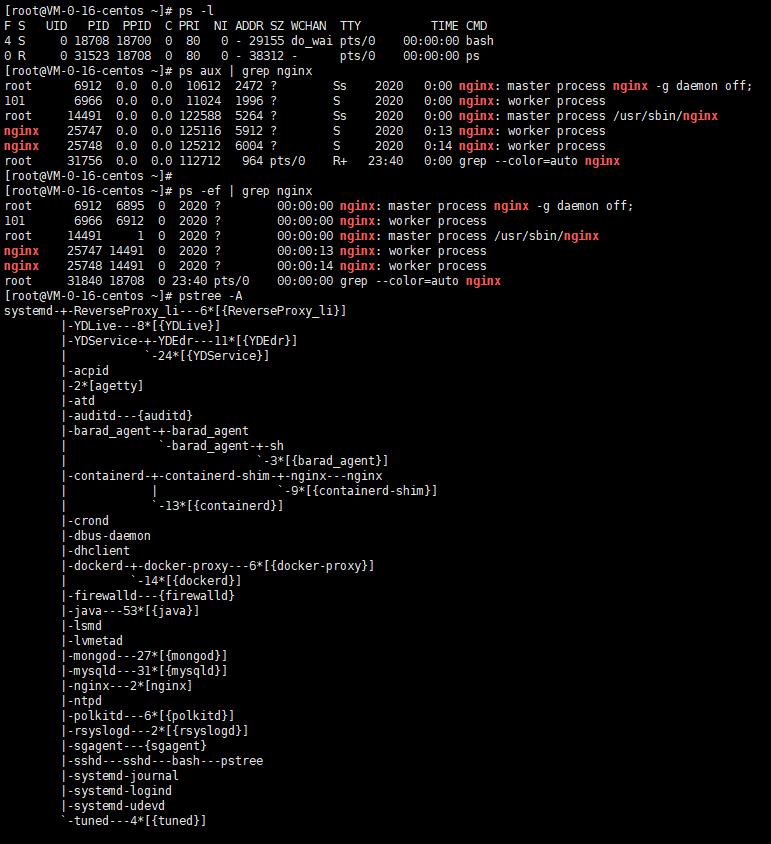
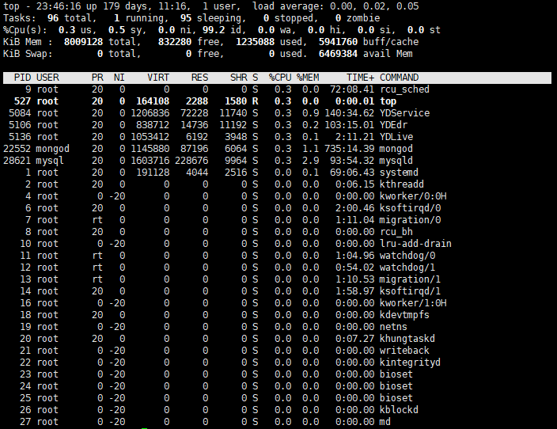

## 系统信息

### 1. uname
用于查看系统信息
```
uname -a    显示全部信息
```

### 2. lscpu  
cpu 架构信息


## 文件和目录操作

### 1. ls
列出文件或者目录的信息，目录的信息就是其中包含的文件。

```
## ls [-aAdfFhilnrRSt] file|dir
-a ：列出全部的文件
-d ：仅列出目录本身
-l ：以长数据串行列出，包含文件的属性与权限等等数据
-h : 和 -l 一起使用，列出文件同时以合理易读的单位显示文件大小
```

### 2. cd
更换当前目录。
```
cd [相对路径或绝对路径]
```

### 3. mkdir
创建目录。
```
## mkdir [-mp] 目录名称
-m ：配置目录权限
-p ：递归创建目录
```

### 4. rmdir
删除目录，目录必须为空。
```
rmdir [-p] 目录名称
-p ：递归删除目录
```

### 5. touch
更新文件时间或者建立新文件。
```
## touch [-acdmt] filename
-a ： 更新 atime
-c ： 更新 ctime，若该文件不存在则不建立新文件
-m ： 更新 mtime
-d ： 后面可以接更新日期而不使用当前日期，也可以使用 --date="日期或时间"
-t ： 后面可以接更新时间而不使用当前时间，格式为[YYYYMMDDhhmm]
```

### 6. cp
复制文件。如果源文件有两个以上，则目的文件一定要是目录才行。
```
cp [-adfilprsu] source destination
-a ：相当于 -dr --preserve=all
-d ：若来源文件为链接文件，则复制链接文件属性而非文件本身
-i ：若目标文件已经存在时，在覆盖前会先询问
-p ：连同文件的属性一起复制过去
-r ：递归复制
-u ：destination 比 source 旧才更新 destination，或 destination 不存在的情况下才复制
--preserve=all ：除了 -p 的权限相关参数外，还加入 SELinux 的属性, links, xattr 等也复制了
```

### 7. rm
删除文件。
```
## rm [-fir] 文件或目录
-r ：递归删除
```

### 8. mv
移动文件。
```
## mv [-fiu] source destination
## mv [options] source1 source2 source3 .... directory
-f ： force 强制的意思，如果目标文件已经存在，不会询问而直接覆盖
```

## 查看文件内容
### 1. cat
取得文件内容。
```
## cat [-AbEnTv] filename
-n ：打印出行号，连同空白行也会有行号，-b 不会

```

### 2. tac
是 cat 的反向操作，从最后一行开始打印。

### 3. more
和 cat 不同的是它可以一页一页查看文件内容，比较适合大文件的查看。

### 4. less
和 more 类似，但是多了一个向前翻页的功能。

### 5. head
取得文件前几行。
```
## head [-n number] filename
-n ：后面接数字，代表显示几行的意思
```

### 6. tail
是 head 的反向操作，只是取得是后几行。  
常用：  
```bash
tail -f xx  #实时查看
tail -100f xx  #实时查看最后的一百行
```

### 7. od
以字符或者十六进制的形式显示二进制文件。

## 用户和用户组
### 用户
添加新的用户账号使用 useradd 命令，删除使用 userdel 命令，修改使用 usermod 命令
```bash
useradd 选项 用户名
useradd mysql -g mysql #添加 mysql 用户归属 mysql 用户组
```
```bash
userdel 选项 
userdel -r sam  #-r的作用是把用户的主目录一起删除
```
此命令删除用户sam在系统文件中（主要是/etc/passwd, /etc/shadow, /etc/group等）的记录，同时删除用户的主目录

```bash
usermod 选项 用户名
usermod -s /bin/ksh -d /home/z –g developer sam
```
此命令将用户sam的登录Shell修改为ksh，主目录改为/home/z，用户组改为developer


### 用户组
增加用户组
```
groupadd 选项 用户组
```

删除用户组
```
groupdel 用户组
```

修改用户组
```
groupmod 选项 用户组
```

## 权限操作
chmod ［who］ ［+ | - | =］ ［mode］ 文件名  
命令中各选项的含义为：
操作对象who可是下述字母中的任一个或者它们的组合：
```
u 表示“用户（user）”，即文件或目录的所有者。
g 表示“同组（group）用户”，即与文件属主有相同组ID的所有用户。
o 表示“其他（others）用户”。
a 表示“所有（all）用户”。它是系统默认值。
```
操作符号可以是：
```
+ 添加某个权限。
- 取消某个权限。
= 赋予给定权限并取消其他所有权限（如果有的话）。
```
设置mode所表示的权限可用下述字母的任意组合：
```
r 可读。
w 可写。
x 可执行。
X 只有目标文件对某些用户是可执行的或该目标文件是目录时才追加x 属性。
s 在文件执行时把进程的属主或组ID置为该文件的文件属主。方式“u＋s”设置文件的用户ID位，“g＋s”设置组ID位。
t 保存程序的文本到交换设备上。
u 与文件属主拥有一样的权限。
g 与和文件属主同组的用户拥有一样的权限。
o 与其他用户拥有一样的权限。
```
可以将一组权限用数字来表示，此时一组权限的 3 个位当做二进制数字的位，从左到右每个位的权值为 4、2、1，即每个权限对应的数字权值为 r : 4、w : 2、x : 1。

示例：
ls -l 命令 查看文件显示
```bash
drw-rw-rw- 4 root root 4096 Dec  3 06:05 SSR-Bash-Python
-rw-r--r-- 1 root root   22 Jan 11 22:38 test.txt
```
前面的  drw-rw-rw- 之类  ，第一位含义：  
普通文件的文件权限第一个字符为“-”  
目录文件的文件权限第一个字符为“d”  
字符设备文件的文件权限第一个字符为“c”  
块设备文件的文件权限第一个字符为“b”  
符号链接文件的文件权限第一个字符为“s”

后面九位为三个用户组的权限，每个用户组三位，读、写、执行权限为 rwx ，没哪个则哪个为 - ，如 r-- 为只读，没有写和执行权限。  
添加权限方式  
1、 chmod a+w filename   为所有用户给filename文件增加写(w)权限  
2、chmod 777 filename  所用用户拥有filename的所有权限

## 搜索
### 1. which
指令搜索。
```
## which [-a] command
-a ：将所有指令列出，而不是只列第一个
```

### 2. whereis
文件搜索。速度比较快，因为它只搜索几个特定的目录。
```
## whereis [-bmsu] dirname/filename
```

### 3. locate
文件搜索。可以用关键字或者正则表达式进行搜索。


## 压缩和打包
### 压缩文件名
Linux 底下有很多压缩文件名，常见的如下：
|扩展名|压缩程序|
|---|---|
|*.Z	|compress|
|*.zip	|zip
|*.gz	|gzip
|*.bz2	|bzip2
|*.xz	|xz
|*.tar	|tar 程序打包的数据，没有经过压缩
|*.tar.gz	|tar 程序打包的文件，经过 gzip 的压缩
|*.tar.bz2	|tar 程序打包的文件，经过 bzip2 的压缩
|*.tar.xz	|tar 程序打包的文件，经过 xz 的压缩
### 压缩指令
### 1. gzip
gzip 是 Linux 使用最广的压缩指令，可以解开 compress、zip 与 gzip 所压缩的文件。  
经过 gzip 压缩过，源文件就不存在了。  
有 9 个不同的压缩等级可以使用。  
可以使用 zcat、zmore、zless 来读取压缩文件的内容。
```
$ gzip [-cdtv#] filename
-c ：将压缩的数据输出到屏幕上
-d ：解压缩
-t ：检验压缩文件是否出错
-v ：显示压缩比等信息
-# ： # 为数字的意思，代表压缩等级，数字越大压缩比越高，默认为 6
```

### 2. bzip2
提供比 gzip 更高的压缩比。  
查看命令：bzcat、bzmore、bzless、bzgrep。
```
$ bzip2 [-cdkzv#] filename
-k ：保留源文件
```

### 3. xz
提供比 bzip2 更佳的压缩比。  
可以看到，gzip、bzip2、xz 的压缩比不断优化。不过要注意的是，压缩比越高，压缩的时间也越长。  
查看命令：xzcat、xzmore、xzless、xzgrep。
```
$ xz [-dtlkc#] filename
```

### 打包
压缩指令只能对一个文件进行压缩，而打包能够将多个文件打包成一个大文件。tar 不仅可以用于打包，也可以使用 gzip、bzip2、xz 将打包文件进行压缩。
```
$ tar [-z|-j|-J] [cv] [-f 新建的 tar 文件] filename...  ==打包压缩
$ tar [-z|-j|-J] [tv] [-f 已有的 tar 文件]              ==查看
$ tar [-z|-j|-J] [xv] [-f 已有的 tar 文件] [-C 目录]    ==解压缩
-z ：使用 zip；
-j ：使用 bzip2；
-J ：使用 xz；
-c ：新建打包文件；
-t ：查看打包文件里面有哪些文件；
-x ：解打包或解压缩的功能；
-v ：在压缩/解压缩的过程中，显示正在处理的文件名；
-f : filename：要处理的文件；
-C 目录 ： 在特定目录解压缩。
```
|使用方式|命令|
|---|---|
|打包压缩	|tar -jcv -f filename.tar.bz2 要被压缩的文件或目录名称
|查看	|tar -jtv -f filename.tar.bz2
|解压缩	|tar -jxv -f filename.tar.bz2 -C 要解压缩的目录


## 防火墙
### iptables 
```
开启： chkconfig iptables on  
关闭： chkconfig iptables off   
```
即时生效，重启后失效  
```
开启： service iptables start   
关闭： service iptables stop   
状态 service iptables status  
```

### firewalld 
```
service firewalld status; #查看防火墙状态
service firewalld start;  或者 #systemctl start firewalld.service;#开启防火墙
service firewalld stop;  或者 #systemctl stop firewalld.service;#关闭防火墙
service firewalld restart;  或者 #systemctl restart firewalld.service;  #重启防火墙
systemctl disable firewalld.service#禁止防火墙开启自启
```

## vi/vim 基本操作
### vi与vim两者区别  
它们都是多模式编辑器，不同的是vim 是vi的升级版本，它不仅兼容vi的所有指令，而且还有一些新的特性在里面。  
vim的这些优势主要体现在以下几个方面：  
1.多级撤消  
我们知道在vi里，按 u只能撤消上次命令，而在vim里可以无限制的撤消。  
2.易用性  
vi只能运行于unix中，而vim不仅可以运行于unix,windows ,mac等多操作平台。  
3.语法加亮  
vim可以用不同的颜色来加亮你的代码。  
4.可视化操作  
就是说vim不仅可以在终端运行，也可以运行于x window、 mac os、 windows。  
5.对vi的完全兼容  
某些情况下，你可以把vim当成vi来使用

### 使用 vi  文件名  或者  vim 文件名   打开文件
按i进入编辑  
按esc退出编辑  
打开状态操作：  
```
u   撤销上一步操作
ctrl+r   恢复上一步被撤销的操作
/字符串    搜索字符串
:%s/aa/bb    把aa替换成bb
编辑状态操作：
:w   保存
:q   退出，有提示
:q!   强制退出
:wq   保存退出（强制写入文件并退出）
:x   保存退出（有修改时才写入文件并退出）
```
按esc回到打开状态

其他操作
```
gg  回到顶端
G  到底端
u  撤销  
ctrl+r  恢复上一步被撤销的操作
ctrl+b 向上翻页
ctrl+f  向下翻页
```

### vi操作异常中断
提示Found a swap file by the name  
删除目录下的隐藏文件，恢复操作;  
ls -a 查看swap隐藏文件，rm 命令删除即可。


## 进程管理
### 1.ps
```
ps -l # 查看自己的进程
ps aux # 查看系统所有进程
ps aux | grep nginx # 查看特定进程nginx
ps -ef | grep nginx # 同上
pstree -A # 查看进程树
```


2.top

**第一行，任务队列信息，同 uptime 命令的执行结果**

系统时间：23:46:16  
运行时间：up 179 days, 11:16,  
当前登录用户： 1 users  
负载均衡(uptime) load average: 0.00, 0.02, 0.05

average后面的三个数分别是1分钟、5分钟、15分钟的负载情况。  
load average数据是每隔5秒钟检查一次活跃的进程数，然后按特定算法计算出的数值。如果这个数除以逻辑CPU的数量，结果高于5的时候就表明系统在超负荷运转了

**第二行，Tasks — 任务（进程）**  
总进程:96 total, 运行:1 running, 休眠:95 sleeping, 停止: 0 stopped, 僵尸进程: 0 zombie

**第三行，cpu状态信息**  
0.3%us【user space】— 用户空间占用CPU的百分比  
0.5%sy【sysctl】— 内核空间占用CPU的百分比  
0.0%ni【】— 改变过优先级的进程占用CPU的百分比  
99.2%id【idolt】— 空闲CPU百分比  
0.0%wa【wait】— IO等待占用CPU的百分比  
0.0%hi【Hardware IRQ】— 硬中断占用CPU的百分比  
0.0%si【Software Interrupts】— 软中断占用CPU的百分比  

**第四行,内存状态**  
8009128 total,   832280 free,  1235088 used,  5941760 buff/cache【buffers缓存的内存量】

**第五行，swap交换分区信息**  
0 total,  0 free,  0 used.  6469384 avail Mem【cached缓冲的交换区总量】

备注：  
可用内存=free + buffer + cached对于内存监控，在top里我们要时刻监控第五行swap交换分区的used，如果这个数值在不断的变化，说明内核在不断进行内存和swap的数据交换，这是真正的内存不够用了。第四行中使用中的内存总量（used）指的是现在系统内核控制的内存数，第四行中空闲内存总量（free）是内核还未纳入其管控范围的数量。纳入内核管理的内存不见得都在使用中，还包括过去使用过的现在可以被重复利用的内存，内核并不把这些可被重新使用的内存交还到free中去，因此在linux上free内存会越来越少，但不用为此担心。

## 参考

- [1] [Linux基本概念及常用命令实现汇总](https://reid.run/archives/linux1#toc-head-45)

- [2] [Linux 命令大全](https://www.runoob.com/linux/linux-command-manual.html)

- [3] [鸟哥的 Linux 私房菜](http://linux.vbird.org/)